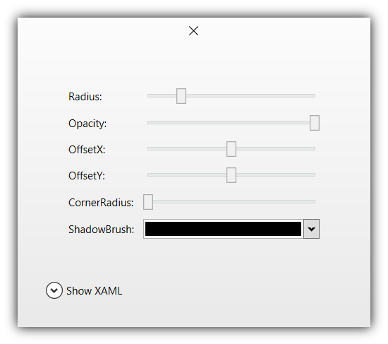

# WindowExtras for WPF
<a href="https://www.nuget.org/packages/WindowExtras.Wpf" target="_blank"></a>

This .NET library makes very it easy to attach a custom shadow to the standard WPF window without having to override the window template
or even making the window transparent. Here's a minimal example:

```XAML
<Window x:Class="MainWindow"
        xmlns="http://schemas.microsoft.com/winfx/2006/xaml/presentation"
        xmlns:x="http://schemas.microsoft.com/winfx/2006/xaml"
        xmlns:winex="https://github.com/yariker/WindowExtras.Wpf"
        Width="300" Height="200"
        ResizeMode="NoResize"
        WindowStartupLocation="CenterScreen"
        WindowStyle="None">
    
    <!-- Notice the new attached property below. -->
    <winex:WindowShadow.Shadow>
        <winex:WindowShadow OffsetY="15" Opacity="0.3" Radius="30" />
    </winex:WindowShadow.Shadow>

    <Button Width="100" Height="32" Click="CloseButtonClick" Content="Close">
        <x:Code><![CDATA[void CloseButtonClick(object sender, EventArgs e) => Close();]]></x:Code>
    </Button>

</Window>
```

Here are some notable features of the drop shadow provided by this library:
* Does not affect the actual size of the host window
* Completely customizable (color, amount of blur, opacity, offset, corner radius, etc.)
* Transparent to mouse clicks (just like any standard window shadow)
* Respects the "Show shadows under windows" option in Performance Options in Windows settings
* Style/ResourceDictionary-friendly and animatable

# Gallery

<p float='middle'>
  
  
  
</p>

Download the [Demo app](https://github.com/yariker/WindowExtras.Wpf/releases) to try it yourself!
